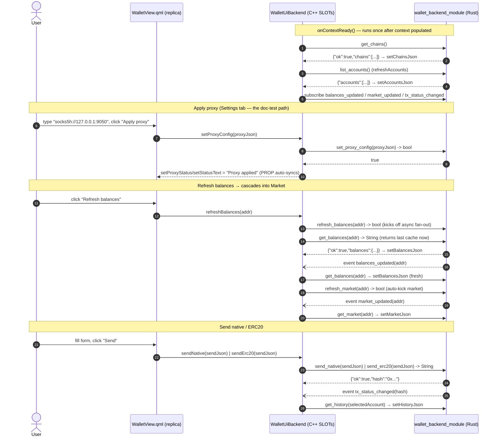

# `logos-evm-wallet-ui` — Specification & Reference

## Purpose

`logos-evm-wallet-ui` is the **Metamask-like graphical front-end** for the Logos
multi-chain EVM wallet. It is a **universal C++ `ui_qml` Logos module**: a hand-written
C++/QtRO backend (`WalletUiBackend`) paired with a single QML view (`qml/WalletView.qml`).
The QML view renders the wallet (six tabs — **Balances, Market, Send, Tokens, History,
Settings**); the C++ backend turns every UI gesture into a typed call against
[`wallet_backend_module`](https://github.com/logos-co/logos-evm-wallet-backend-module)
over the Logos bridge and pushes the backend's JSON results (and live events) back into
QtRO properties that the QML view auto-binds to.

The UI itself holds **no chain logic, no keys, and no network code**. It is a thin
presentation/coordination layer: all balances, token lists, prices, signing, send
orchestration, history, and proxy/privacy enforcement live in `wallet_backend_module`
and the modules below it. The UI never talks to an RPC endpoint or a keystore directly —
it only drives the backend.

> **Note on the README.** The repo's `README.md` describes an older "QML-only, no
> C++/QtRO backend" design where QML drove the backend directly via `logos.callModule`.
> The current source (this commit) is the **universal C++ backend** model: `metadata.json`
> declares `"interface": "universal"` with a `codegen.rep` contract, `CMakeLists.txt`
> builds `src/wallet_ui_backend.{h,cpp}`, and the QML talks to a generated C++ replica
> (`logos.module("wallet_ui")`) rather than calling the backend module directly. This
> document reflects the **source**, which is authoritative.

### Where this repo sits in the EVM-wallet system

```
            ┌──────────────────────────────────────────────────────────┐
            │  logos-evm-wallet-ui   ← YOU ARE HERE                     │
            │  universal ui_qml: C++ QtRO backend + QML view           │
            └──────────────────────────────┬───────────────────────────┘
                                           │ typed modules().wallet_backend_module.*
                                           │ (Logos bridge / QtRO)
                                           ▼
            ┌──────────────────────────────────────────────────────────┐
            │  wallet_backend_module   (Rust coordinator + alloy)      │
            └───┬───────────────┬───────────────┬──────────────┬───────┘
                │               │               │              │
         keystore_module   eth_rpc_module  token_list_module  uniswap_module
         (keys, signing)   (multi-chain    (token lists)      (V2/V3/V4 prices,
                            JSON-RPC,                           swaps)
                            concurrency:multi)                  (concurrency:multi)
                                │               │              │
                                ▼               ▼              │
                         logos-evm-net-proxy (fail-closed HTTP)◄┘
```

The UI declares **all** of `eth_rpc_module`, `keystore_module`, `token_list_module`,
`uniswap_module`, and `wallet_backend_module` as dependencies (`metadata.json#dependencies`
and `flake.nix` inputs), but it **only calls** `wallet_backend_module`. The leaf modules
are declared so that the bundled standalone app can auto-load the entire dependency tree
in the right order — without them the backend can't load and the UI's calls would time
out.

---

## Overall architecture

The repo is a universal `ui_qml` module. The author writes exactly three artifacts — the
`.rep` view contract, the C++ backend that implements it, and the QML view. Everything
else (the `*Plugin` glue, `Q_PLUGIN_METADATA`, `initLogos` wiring, QtRO replica
registration, the generated `modules()` umbrella, and the standalone-app shell) is
generated by `logos-module-builder` (`mkLogosQmlModule`).

```mermaid
flowchart TB
    subgraph repo["logos-evm-wallet-ui (this repo — author-written files)"]
        rep["src/wallet_ui.rep<br/>QtRO view contract:<br/>10 PROPs (READONLY/READWRITE)<br/>16 SLOTs"]
        h["src/wallet_ui_backend.h<br/>WalletUiBackend :<br/>WalletUiSimpleSource +<br/>LogosUiPluginContext"]
        cpp["src/wallet_ui_backend.cpp<br/>SLOT implementations +<br/>onContextReady() event wiring"]
        qml["qml/WalletView.qml<br/>6-tab Metamask-like view<br/>(objectName walletRoot)"]
        meta["metadata.json<br/>type ui_qml / interface universal<br/>view + codegen.rep + deps"]
        cmake["CMakeLists.txt<br/>logos_module(REP_FILE...)"]
    end

    subgraph gen["Generated by logos-module-builder (mkLogosQmlModule)"]
        repc["repc → WalletUiSimpleSource (source)<br/>+ WalletUiReplica (QML side)"]
        plug["wallet_ui_plugin<br/>Q_PLUGIN_METADATA, initLogos(),<br/>QtRO host registration"]
        sdk["logos_sdk.h → modules()<br/>typed callers + typed events<br/>for wallet_backend_module"]
        app["apps.default = standalone app shell<br/>(logos-standalone-app: --width/--height)<br/>bundles + auto-loads backend tree"]
    end

    subgraph runtime["Runtime surfaces"]
        replica["QML replica:<br/>logos.module(\"wallet_ui\")<br/>PROPs auto-sync, SLOTs callable"]
        backend_dep[("wallet_backend_module<br/>over the Logos bridge")]
    end

    rep --> repc
    repc --> h
    h --> cpp
    cpp -->|"modules().wallet_backend_module.*"| sdk
    meta --> plug
    cmake --> plug
    rep --> plug
    h --> plug
    qml --> replica
    repc --> replica
    plug --> replica
    replica -->|"PROP reads + SLOT calls (QtRO)"| cpp
    sdk -->|"typed RPC over bridge"| backend_dep
    backend_dep -->|"return JSON strings + events"| sdk
    meta --> app
    app --> backend_dep

    classDef authored fill:#1f6feb,stroke:#0b3a8c,color:#fff;
    classDef generated fill:#6e40c9,stroke:#3d2475,color:#fff;
    classDef rt fill:#2e7d32,stroke:#14471a,color:#fff;
    class rep,h,cpp,qml,meta,cmake authored;
    class repc,plug,sdk,app generated;
    class replica,backend_dep rt;
```

### The three layers

| Layer | File(s) | Role |
|-------|---------|------|
| **View contract** | `src/wallet_ui.rep` | QtRO `class WalletUi` — declares 10 `PROP`s (state pushed to QML) and 16 `SLOT`s (UI-callable methods). `repc` generates `WalletUiSimpleSource` (C++ side) and a replica (QML side). |
| **C++ backend** | `src/wallet_ui_backend.{h,cpp}` | `WalletUiBackend` implements every SLOT and feeds the PROPs. It derives `WalletUiSimpleSource` (generated source object) and `LogosUiPluginContext` (gives `onContextReady()` + `modules()`). |
| **QML view** | `qml/WalletView.qml` | The visible UI. Binds to `logos.module("wallet_ui")` PROPs and calls its SLOTs. Root `Item` has `objectName: "walletRoot"` with a `selectTab(i)` helper. |

### State flow (one round-trip)

1. The user acts in QML (clicks **Refresh balances**, types a proxy URL, etc.).
2. QML calls a SLOT on the replica, e.g. `backend.refreshBalances(addr)`.
3. QtRO marshals the call to the C++ `WalletUiBackend` SLOT.
4. The backend calls `modules().wallet_backend_module.<method>(...)` over the Logos
   bridge — a typed RPC into the Rust backend module.
5. The backend writes the JSON result (or a fixed status string) into a PROP via a
   generated setter (`setBalancesJson(...)`, `setStatusText(...)`).
6. QtRO auto-syncs the PROP to the QML replica; QML's property bindings re-render.

For **events** (live updates not triggered by a UI action), the backend subscribes once
in `onContextReady()` to `wallet_backend_module`'s events (`balances_updated`,
`market_updated`, `tx_status_changed`) and re-pulls the corresponding PROP when one fires.

---

## Communication with `wallet_backend_module`

Every method the C++ backend calls is `modules().wallet_backend_module.<name>(...)` (typed
caller generated from `metadata.json#dependencies`). The names and signatures below are the
**exact** backend trait methods (verified against `wallet-backend-module/rust-lib/src/glue.rs`).

### Outbound calls and subscribed events



### Complete outbound call map

Each UI method maps 1:1 (or 1:N) to backend trait calls. `→` means "writes this PROP from
the result".

| UI backend SLOT | Backend call(s) `modules().wallet_backend_module.…` | PROP(s) updated |
|---|---|---|
| `onContextReady()` (lifecycle) | `get_chains()`, then `refreshAccounts()`; subscribes `balances_updated`, `market_updated`, `tx_status_changed` | `chainsJson`, (via refresh) `accountsJson`, `statusText` |
| `setProxyConfig` | `set_proxy_config(proxyJson)` | `proxyStatus`, `statusText` |
| `setChains` | `set_chains(chainsJson)`; on success `get_chains()` | `chainsJson`, `statusText` |
| `testEndpoint` | `test_endpoint(chainId)` | — (returns to caller) |
| `createAccount` | `create_account(passphrase, label)`; then `refreshAccounts()` | `accountsJson`, `statusText` |
| `importMnemonic` | `import_mnemonic(phraseJson, label)`; then `refreshAccounts()` | `accountsJson`, `statusText` |
| `refreshAccounts` | `list_accounts()` | `accountsJson` |
| `unlock` | `unlock(address, passphrase)` | `accountUnlocked`, `statusText` |
| `lock` | `lock(address)` | `accountUnlocked`, `statusText` |
| `refreshBalances` | `refresh_balances(address)` (async kick), then `get_balances(address)` | `balancesJson`, `statusText` |
| `loadTokens` | `get_tokens(chainId)` | `tokensJson` |
| `addCustomToken` | `add_custom_token(tokenJson)` | `statusText` |
| `refreshMarket` | `refresh_market(address)` | `statusText` (result lands via event → `marketJson`) |
| `estimateFee` | `estimate_fee(sendJson)` | — (returns to caller) |
| `sendNative` | `send_native(sendJson)` | `statusText` (returns hash JSON) |
| `sendErc20` | `send_erc20(sendJson)` | `statusText` (returns hash JSON) |
| `refreshHistory` | `get_history(address)` | `historyJson` |
| **event** `balances_updated(addr)` | `get_balances(addr)` + `refresh_market(addr)` | `balancesJson` (and later `marketJson`) |
| **event** `market_updated(addr)` | `get_market(addr)` | `marketJson` |
| **event** `tx_status_changed(_)` | `get_history(selectedAccount())` (if a selection exists) | `historyJson` |

---

## Full API reference

The public surface is the QtRO **view contract** in `src/wallet_ui.rep`: **10 properties**
the QML view reads, and **16 slots** the QML view (or a headless qt-mcp driver) calls. All
slots are implemented in `WalletUiBackend` (`src/wallet_ui_backend.cpp`); the corresponding
backend method's return shape is documented under each.

### Properties (state pushed to QML)

PROPs are set in C++ via generated setters (`setStatusText`, `setBalancesJson`, …) and
auto-synced to the QML replica, where the view reads them as `backend.<prop>`.

| Property | Type | Access | Meaning | Backing setter call |
|---|---|---|---|---|
| `statusText` | `QString` | READONLY | Human-readable status line (shown below the tabs). Initial value `"Ready"`. | many slots |
| `chainsJson` | `QString` | READONLY | JSON `{"ok":true,"chains":[…]}` of configured chains. | `get_chains()` |
| `accountsJson` | `QString` | READONLY | JSON `{"accounts":[…]}` of keystore accounts (addresses + labels). | `list_accounts()` |
| `selectedAccount` | `QString` | **READWRITE** | The address selected in the account combo box. QML writes it on selection; the `tx_status_changed` handler reads it. | (QML-driven) |
| `accountUnlocked` | `bool` | READONLY | Whether the currently selected account is unlocked. | `unlock`/`lock` |
| `balancesJson` | `QString` | READONLY | JSON `{"ok":true,"balances":{address,chains:[…]}}` aggregate. | `get_balances()` |
| `tokensJson` | `QString` | READONLY | JSON `{"tokens":[…]}` token list for a chain. | `get_tokens()` |
| `historyJson` | `QString` | READONLY | JSON `{"ok":true,"history":[…]}` local tx records. | `get_history()` |
| `marketJson` | `QString` | READONLY | JSON `{"ok":true,"address","chains":[{chainId,items:[…]}]}` Uniswap-priced holdings. | `get_market()` |
| `proxyStatus` | `QString` | READONLY | `"Proxy applied"` / `"Proxy failed"` after a proxy apply. Initial `""`. | `setProxyConfig` |

### Slots (UI-callable methods)

Each entry gives the **exact** signature from `src/wallet_ui.rep`, parameter meanings, the
backend call(s) it makes, the success/error shape, and an example. Slots that return a
`QString` return the backend's JSON string verbatim; `bool`/`void` slots update PROPs and/or
return a status flag. Backend JSON returns use the convention `{"ok":true,…}` on success and
`{"ok":false,"error":"…"}` on failure (`err(e)` in the backend).

---

#### Config / privacy

##### `bool setProxyConfig(QString proxyJson)`

Applies the privacy proxy configuration to the backend (pushed down to the net-proxy used
by eth-rpc and token-list).

- **`proxyJson`** — JSON object. The QML Settings tab sends
  `{"proxy": "<socks5h url>"|null, "proxyRequired": <bool>}`.
- **Backend call:** `set_proxy_config(proxyJson) -> bool`.
- **Returns:** `true` if applied. Sets `proxyStatus` and `statusText` to
  `"Proxy applied"` (success) or `"Proxy failed"` (failure).
- **Example (QML):**
  `backend.setProxyConfig(JSON.stringify({proxy:"socks5h://127.0.0.1:9050", proxyRequired:true}))`

##### `bool setChains(QString chainsJson)`

Replaces the chain configuration in the backend and re-pulls `chainsJson`.

- **`chainsJson`** — JSON array/object of chain configs (chainId, name, RPC endpoint,
  multicall3 address, …) as the backend expects.
- **Backend call:** `set_chains(chainsJson) -> bool`; on success `get_chains()` →
  `chainsJson` PROP.
- **Returns:** `true` on success. `statusText` = `"Chains updated"` or `"Set chains failed"`.

##### `QString testEndpoint(int chainId)`

Verifies the configured RPC endpoint for a chain (round-trips a `chainId` check through
eth-rpc).

- **`chainId`** — numeric EVM chain id.
- **Backend call:** `test_endpoint(chainId) -> String` (delegates to
  `eth_rpc_module.verify_chain_id`).
- **Returns (success):** the backend's JSON verification result (e.g. the matched chainId);
  **error:** `{"ok":false,"error":"…"}`.

---

#### Accounts (signing stays in `keystore_module`)

The UI never sees private keys. Account creation/import returns only public metadata; the
key material is held inside `keystore_module`.

##### `QString createAccount(QString passphrase, QString label)`

Creates a brand-new account in the keystore.

- **`passphrase`** — passphrase that encrypts the new key at rest.
- **`label`** — human-friendly label attached to the account.
- **Backend call:** `create_account(passphrase, label) -> String`; then `refreshAccounts()`.
- **Returns:** backend JSON describing the new account (address + label). `statusText` =
  `"Account created"`.

##### `QString importMnemonic(QString phraseJson, QString label)`

Imports an account from a BIP-39 mnemonic.

- **`phraseJson`** — JSON carrying the mnemonic phrase (and optional derivation params) in
  the shape the backend/keystore expects.
- **`label`** — label for the imported account.
- **Backend call:** `import_mnemonic(phraseJson, label) -> String`; then `refreshAccounts()`.
- **Returns:** backend JSON for the imported account. `statusText` = `"Account imported"`.

##### `void refreshAccounts()`

Re-pulls the account list into `accountsJson`.

- **Backend call:** `list_accounts() -> String` → `accountsJson` PROP.
- **Returns:** nothing (updates the PROP).

##### `bool unlock(QString address, QString passphrase)`

Unlocks an account for signing.

- **`address`** — `0x…` account address.
- **`passphrase`** — the account's passphrase.
- **Backend call:** `unlock(address, passphrase) -> bool`.
- **Returns:** `true` on success → `accountUnlocked = true`, `statusText = "Unlocked"`;
  on failure `accountUnlocked = false`, `statusText = "Wrong passphrase"`.

##### `bool lock(QString address)`

Locks an account (forgets the decrypted key in the keystore).

- **`address`** — `0x…` account address.
- **Backend call:** `lock(address) -> bool`.
- **Returns:** `true`; always sets `accountUnlocked = false`, `statusText = "Locked"`.

---

#### Balances + tokens

##### `void refreshBalances(QString address)`

Triggers a fresh multi-chain balance fetch and immediately shows the last cache.

- **`address`** — `0x…` account address to refresh.
- **Backend calls:** `refresh_balances(address) -> bool` (kicks off the async per-chain
  fan-out; the fresh result arrives later via the `balances_updated` event), then
  `get_balances(address) -> String` to populate `balancesJson` with the current cache now.
- **Returns:** nothing. `statusText = "Refreshing balances…"`.
- **Live update:** when the fan-out completes, `balances_updated(address)` fires →
  `balancesJson` is re-pulled **and** `refresh_market(address)` is auto-kicked.

##### `void loadTokens(int chainId)`

Loads the token list for a chain into `tokensJson`.

- **`chainId`** — numeric chain id.
- **Backend call:** `get_tokens(chainId) -> String` → `tokensJson`.
- **Returns:** nothing.

##### `bool addCustomToken(QString tokenJson)`

Adds a user-defined custom token to that chain's list.

- **`tokenJson`** — JSON token descriptor. The QML "Add custom token" dialog sends
  `{"chainId":<int>,"address":"0x…","name":"…","symbol":"…","decimals":<int>}`.
- **Backend call:** `add_custom_token(tokenJson) -> bool`.
- **Returns:** `true` on success. `statusText` = `"Token added"` / `"Add token failed"`.

---

#### Market (Uniswap prices for held tokens)

##### `void refreshMarket(QString address)`

Kicks off the per-chain price fan-out for the account's held tokens.

- **`address`** — `0x…` account address.
- **Backend call:** `refresh_market(address) -> bool`. The backend asks `uniswap_module`
  (`concurrency:"multi"`) for prices across chains concurrently; the priced result is cached
  and surfaced via the `market_updated` event, which the UI handles by calling
  `get_market(address)` → `marketJson`.
- **Returns:** nothing. `statusText` transitions `"Loading market…"` → `"Market updated"`.

---

#### Send

The send slots return their backend JSON to the QML caller (the QML wraps them in
`logos.watch(...)` to receive the async reply).

##### `QString estimateFee(QString sendJson)`

Previews the gas fee for a transfer without broadcasting.

- **`sendJson`** — `SendParams` JSON: `{"from":"0x…","to":"0x…","chainId":<int>,"amount":"<wei|base units>","tokenAddress":"0x…"?}`. `tokenAddress` present ⇒ ERC20 (gas 90 000), absent ⇒ native (gas 21 000).
- **Backend call:** `estimate_fee(sendJson) -> String`.
- **Returns (success):** `{"ok":true,"gasPrice":"<wei>","gasLimit":<int>,"feeWei":"<wei>"}`;
  **error:** `{"ok":false,"error":"…"}`.

##### `QString sendNative(QString sendJson)`

Builds, signs, broadcasts, and records a native (ETH-value) transfer.

- **`sendJson`** — `SendParams` (see above); `amount` is in **wei**.
- **Backend call:** `send_native(sendJson) -> String` (full build→sign→broadcast→record
  pipeline; signing happens in the keystore, never in the UI).
- **Returns (success):** `{"ok":true,"hash":"0x…"}`; **error:** `{"ok":false,"error":"…"}`.
  `statusText` = `"Sending…"` → `"Native transfer submitted"`.
- **Live update:** the backend emits `tx_status_changed(hash)`; the UI re-pulls
  `historyJson` for `selectedAccount`.

##### `QString sendErc20(QString sendJson)`

Builds, signs, broadcasts, and records an ERC20 token transfer.

- **`sendJson`** — `SendParams` with a non-empty `tokenAddress`; `amount` is in the token's
  **base units**.
- **Backend call:** `send_erc20(sendJson) -> String`.
- **Returns:** same shape as `sendNative`. `statusText` = `"Sending…"` →
  `"ERC20 transfer submitted"`.

---

#### History

##### `void refreshHistory(QString address)`

Loads the locally-recorded, wallet-originated transactions for an account.

- **`address`** — `0x…` account address.
- **Backend call:** `get_history(address) -> String` → `historyJson`.
- **Returns:** nothing.

---

## The QML view (`qml/WalletView.qml`) and the tab structure

The root is an `Item { objectName: "walletRoot"; width: 460; height: 760 }`. It obtains the
backend replica with `readonly property var backend: logos.module("wallet_ui")` and tracks
readiness via `logos.isViewModuleReady("wallet_ui")` / `onViewModuleReadyChanged`.

### Shared chrome (always visible, above/below the tabs)

- **Header** — "Logos Wallet" title and a connection indicator ("Connected to backend" /
  "Connecting to backend…").
- **Accounts row** — a `ComboBox` (`objectName`-less, id `acctBox`) bound to `root.accounts`;
  selecting writes `backend.selectedAccount`. A **Lock/Unlock** button (opens the unlock
  dialog or calls `backend.lock`) and a **New** button (opens the create-account dialog).
- **Status line** — bound to `backend.statusText`, shared below the tabs. The doc-test
  asserts on this line (e.g. waiting for `"Proxy applied"`).

### Tabs (`TabBar` id `tabs`, `objectName: "walletTabs"` + `StackLayout`)

The tab index ↔ page mapping (used by the `selectTab(i)` helper) is:

| Index | Tab | Key controls | Reads PROP | Action → SLOT |
|---|---|---|---|---|
| 0 | **Balances** | "Refresh balances" button; per-chain frames (native + token balances) | `balancesJson` | `refreshBalances(acct)` |
| 1 | **Market** | "Refresh market" button; per-chain priced items (symbol, `$usd`, `$valueUsd`) | `marketJson` | `refreshMarket(acct)` |
| 2 | **Send** | chain combo, "ERC20 token" checkbox, token/recipient/amount fields, **Estimate** + **Send** | `chainsJson`, `accountUnlocked` | `estimateFee`, `sendNative`/`sendErc20` |
| 3 | **Tokens** | "Load tokens" button; token list; "Add custom token" dialog | `tokensJson`, `chainsJson` | `loadTokens`, `addCustomToken` |
| 4 | **History** | "Recent activity"; per-tx rows (kind · status · hash), colored by status | `historyJson` | (event-driven via `tx_status_changed`) |
| 5 | **Settings** | proxy URL field (`placeholderText: socks5h://127.0.0.1:9050`), "Require proxy (fail-closed)" checkbox, **Apply proxy** | — | `setProxyConfig` |

The view parses each JSON PROP through a small `parseField(json, field, fallback)` helper
(e.g. `chainsJson → .chains`, `marketJson → .chains`, `balancesJson → .balances`).

### Headless-driver hook: `selectTab(i)`

Because only the **active** `StackLayout` page's controls are in the visible scene, the
view exposes `function selectTab(i) { tabs.currentIndex = Number(i) }`. The doc-test drives
navigation by calling this via qt-mcp `call_method` (`find_by objectName "walletRoot"`,
`method "selectTab"`, `args [i]`) and then waiting for a control unique to that page — the
same pattern the tutorial QML UI uses for `coreModulesView.openInterface`.

### Dialogs

- **Unlock** (`unlockDialog`) → `backend.unlock(addr, pw)`.
- **New account** (`createDialog`) → `backend.createAccount(pw, label)` (wrapped in
  `logos.watch`).
- **Add custom token** (`addTokenDialog`) → `backend.addCustomToken(JSON.stringify({chainId,address,name,symbol,decimals}))`.

The `buildSend()` helper composes the `SendParams` JSON from the Send-tab fields:
`{from: acctBox.currentText, to, chainId, amount[, tokenAddress]}`.

---

## Configuration & data model

### Module manifest (`metadata.json`)

| Field | Value | Meaning |
|---|---|---|
| `name` | `wallet_ui` | Module name; QML obtains the replica as `logos.module("wallet_ui")`. |
| `version` | `1.0.0` | |
| `type` | `ui_qml` | A UI module rendered by a QML host. |
| `interface` | `universal` | Universal authoring model (author writes `.rep` + C++ backend; glue generated). |
| `category` | `wallet` | |
| `main` | `wallet_ui_plugin` | Generated plugin entry symbol. |
| `view` | `qml/WalletView.qml` | The QML view loaded by the host. |
| `dependencies` | `["eth_rpc_module","keystore_module","token_list_module","uniswap_module","wallet_backend_module"]` | Drives `wallet_backend_module`; the rest are declared so the bundled app auto-loads the full tree. |
| `codegen.rep` | `src/wallet_ui.rep` | The QtRO contract `repc` compiles. |
| `nix.packages.runtime` | `qt6.qtdeclarative`, `zstd`, `krb5`, `abseil-cpp` | Qt Quick + transitive runtime libs. |

### JSON shapes exchanged with the backend

These are the shapes the UI **parses** (in QML) or **passes through** (in C++). They are
produced by `wallet_backend_module` and reproduced here for the UI's consumers.

**`chainsJson`** (from `get_chains`):
```json
{ "ok": true, "chains": [ { "chainId": 1, "name": "Ethereum", "...": "endpoint/multicall3/..." } ] }
```

**`accountsJson`** (from `list_accounts`, keystore-shaped):
```json
{ "accounts": [ { "address": "0x…", "label": "…" } ] }
```

**`balancesJson`** (from `get_balances`):
```json
{ "ok": true,
  "balances": {
    "address": "0x…",
    "chains": [
      { "chainId": 1, "native": "<wei>",
        "tokens": [ { "address": "0x…", "balance": "<base units>" } ] }
    ] } }
```
(Empty/unknown account ⇒ `{"address": "0x…", "chains": []}`.)

**`marketJson`** (from `get_market` / `build_market`):
```json
{ "ok": true, "address": "0x…",
  "chains": [
    { "chainId": 1,
      "items": [
        { "address": "native", "symbol": "ETH", "decimals": 18,
          "balance": "<wei>", "eth": 1.0, "usd": 3500.12, "valueUsd": 123.45 },
        { "address": "0x…", "symbol": "USDC", "decimals": 6,
          "balance": "<base units>", "eth": 0.0003, "usd": 1.0, "valueUsd": 50.0 }
      ] } ] }
```
Pricing failures degrade gracefully — `usd`/`valueUsd` may be `null`; QML renders `"—"`.
Only held tokens (balance > 0) are priced.

**`tokensJson`** (from `get_tokens`):
```json
{ "tokens": [ { "address": "0x…", "symbol": "USDC", "name": "USD Coin", "decimals": 6 } ] }
```

**`historyJson`** (from `get_history`):
```json
{ "ok": true,
  "history": [
    { "hash": "0x…", "chainId": 1, "from": "0x…", "to": "0x…",
      "value": "<base units>", "kind": "native"|"erc20", "token": "0x…"|null,
      "status": "pending"|"confirmed"|"failed", "timestamp": 1718900000 } ] }
```
QML colors rows by `status`: confirmed → green, failed → red, otherwise amber.

**`SendParams`** (passed to `estimate_fee`/`send_native`/`send_erc20`):
```json
{ "from": "0x…", "to": "0x…", "chainId": 1, "amount": "<wei|base units>", "tokenAddress": "0x…" }
```
`tokenAddress` is omitted/empty for native sends.

**`estimateFee`** result:
```json
{ "ok": true, "gasPrice": "<wei>", "gasLimit": 21000, "feeWei": "<wei>" }
```

**`sendNative`/`sendErc20`** result:
```json
{ "ok": true, "hash": "0x…" }
```

**Proxy config** (`setProxyConfig` input, QML-built):
```json
{ "proxy": "socks5h://127.0.0.1:9050", "proxyRequired": true }
```

**Custom token** (`addCustomToken` input, QML-built):
```json
{ "chainId": 1, "address": "0x…", "name": "MyToken", "symbol": "MTK", "decimals": 18 }
```

### Persisted state

The UI itself persists **nothing** on disk. All persistence (keystore files, balance cache,
chain config, token lists, transaction history) lives in `wallet_backend_module` and the
modules below it. The UI's only in-memory state is the QtRO PROPs and the QML-local
`selectedAccount` selection.

---

## Build, run & test

### Build

```bash
nix build .#install      # -> result/plugins/wallet_ui/ (QML view + manifest + plugin)
```

The plugin declares `wallet_backend_module` (and the leaf modules) as dependencies; a host
(`logos-standalone-app` / `logos-basecamp`) that loads the UI plugin will auto-load the
backend and its dependency tree alongside it. Within the workspace:

```bash
ws build wallet-ui                 # build the UI module
ws build wallet-ui --auto-local    # build with local overrides of any dirty deps
```

### Run as a standalone app

Because the flake uses `mkLogosQmlModule`, it exposes `apps.default` — a self-contained
standalone app (the `logos-standalone-app` shell) that **bundles and auto-loads** the backend
module tree, then renders the QML view:

```bash
nix run github:logos-co/logos-evm-wallet-ui            # launch the wallet app
nix run github:logos-co/logos-evm-wallet-ui -- --height 1000   # taller window
```

The standalone-app shell accepts `--width <px>` and `--height <px>` to size the window
(the default is `1024x768`; the doc-test launches with `--height 1000` so every tab's
controls stay on-screen for the click-based headless driver, which cannot scroll). Headless
operation is via `QT_QPA_PLATFORM=offscreen` (no display required).

A rendered, interactive UI is itself proof that the entire dependency tree
(`wallet_backend_module` + `eth_rpc_module` + `keystore_module` + `token_list_module` +
`uniswap_module`) loaded — the UI's calls only return because the backend is live.

### Doc-test (`doctests/wallet-ui-app.test.yaml`)

The repo ships one executable doc-test that launches the standalone app **headless** and
drives it through the QML inspector with
[`logos-qt-mcp`](https://github.com/logos-co/logos-qt-mcp). It:

1. Builds the qt-mcp driver (`nix build github:logos-co/logos-qt-mcp -o result-mcp`).
2. Launches the app (`nix run … -- --height 1000`), waiting for **"Logos Wallet" /
   "Accounts" / "Refresh balances"** (Balances tab) — capturing `wallet-ui-launch.png`.
3. Navigates every tab via `call_method → selectTab(i)` and asserts a control unique to
   each page: Market → **"Refresh market"**, Send → **"Estimate"**, Tokens →
   **"Load tokens"**, History → **"Recent activity"**, Settings → **"Apply proxy"**.
4. On Settings, sets the proxy field to `socks5h://127.0.0.1:9050` and clicks **Apply
   proxy**, then waits for the status line to flip to **"Proxy applied"** — an end-to-end
   `UI → C++ backend (setProxyConfig) → Rust backend (set_proxy_config)` round-trip — and
   captures `wallet-ui-applied.png`.

Run it locally:

```bash
cd doctests && ./run.sh        # regenerates outputs/wallet-ui-app.md + screenshots
# or with a local doctest checkout:
DOCTEST="nix run path:../../logos-doctest --" ./run.sh
```

CI (`.github/workflows/doctests.yml`) runs the same spec on `ubuntu-latest` and
`macos-latest` for every PR/push to `main`/`master`, then publishes a two-column HTML
report to GitHub Pages and comments the link on the PR.

---

## Security & invariants

- **No keys in the UI.** Account creation, import, unlock/lock, and signing all delegate to
  `keystore_module` via the backend (`create_account`, `import_mnemonic`, `unlock`, `lock`,
  and the signing inside `send_native`/`send_erc20`). Private key material never crosses the
  bridge into the UI — the UI only ever sees addresses, labels, status flags, and tx hashes.
- **Fail-closed privacy chokepoint.** The Settings tab's "Require proxy (fail-closed)"
  toggle and proxy URL flow through `setProxyConfig → set_proxy_config`. Enforcement happens
  in `logos-evm-net-proxy` (used by eth-rpc and token-list): when configured fail-closed it
  **refuses** to make any HTTP/RPC request unless a valid `socks5h://` proxy is set. The UI
  surfaces the result as `proxyStatus`/`statusText`. The backend can also emit a
  `proxy_error` event (the UI does not currently subscribe to it).
- **No direct network access.** The UI has no RPC client, no HTTP code, and no chain
  endpoints of its own. Every chain interaction is mediated by the backend, so the proxy and
  fail-closed guarantees cannot be bypassed from the UI.
- **Process isolation.** As a Logos module, the UI runs process-isolated and communicates
  with the backend only over the typed Logos bridge (QtRO) — no shared memory, no direct
  function calls into the backend module.

## Concurrency

`wallet_ui` is **not** a `concurrency:"multi"` module — it is a UI module and processes its
SLOTs on the Qt event loop. The concurrency it benefits from lives **downstream**:

- `refreshBalances` calls `refresh_balances`, which fans out one async task **per chain**;
  because `eth_rpc_module` is `concurrency:"multi"`, the per-chain RPC reads run
  concurrently. The UI gets the cached aggregate immediately and the fresh result later via
  the `balances_updated` event.
- `refreshMarket` calls `refresh_market`, which prices held tokens **per chain** through
  `uniswap_module` (`concurrency:"multi"`), so the chains price in parallel; the priced
  result arrives via the `market_updated` event.

In both cases the UI's role is fire-and-forget the kick, then react to the completion event
by re-pulling the relevant PROP — keeping the QML view responsive while the concurrent
fan-out runs in the modules below.
